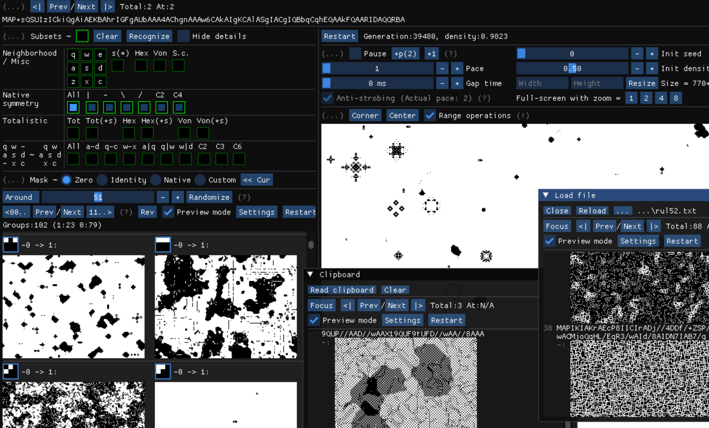

### Starry
This program is designed for exploring 2-state CA rules in the range-1 Moore neighborhood (aka ["MAP rules"](https://golly.sourceforge.io/Help/Algorithms/QuickLife.html#map)).

#### Features
- Rules are saved as MAP-strings, so you are able to test them in other programs like Golly. Also, patterns can be saved as RLE-strings.
- Subset-based rule analysis and edition. The supported subsets include isotropic/totalistic rules in Moore/hexagonal/Von-Neumann neighborhood, self-complementary rules and so on. You can combine multiple subsets to explore rules in the intersection of them (for example, self-complementary isotropic rules).
    - Rule-analysis: the program is able to tell whether a MAP-rule is isotropic/self-complementary etc.
    - Rule-edition: the program is able to generate (theoretically all possible) rules in any supported subsets.
- Preview mode, making it easier to "know" which direction to edit for for more interesting rules.
- The program is able to load lists of MAP rules from files or the clipboard. There are a lot of rules available in `rules/...`.
- "Lock & capture" - the program is able to extract value constraints from patterns and generate rules under the constraints (for example, rules allowing for gliders).

#### Getting started
See the "Documents" part in the program to get familiar with the concepts and operations. I'd recommend firstly checking the "Rules in different subsets" section to get some idea about what can be found with this program.

The operations are either accessible via buttons, or recorded somewhere in the tooltips. Most importantly, here is how to save rules/patterns:
- Saving/undoing rules: right-click the MAP-string to save the current rule to the clipboard; use the widgets right above the MAP-string for undoing/redoing.
- Saving patterns: right-click to select area and press 'C' to save the pattern to the clipboard (as RLE-string).

#### Dependencies & Building
- The project uses CMake for building. The program is written in C++20 using [ImGui](https://github.com/ocornut/imgui) and [SDL2](https://github.com/libsdl-org/SDL) libraries. (ImGui is copied in this project; SDL2 will be fetched automatically by CMake.) In my experience, the project can be opened and built directly in Visual Studio (CMake tools required).
- As to OS dependency: the project is developed on Windows 10, but hopefully also works on other systems (rebuilding needed).

#### Recent plans
- Cleanups for rule lists (those in `rules/...`). There are going to be refined lists of rules in the formal releases.
- Finish documentation for the "lock & capture" feature.
- Refine visual/layout.
- Add support for unbounded space.
- Add support for batch-preview mode for 'Randomize' etc.
- Refine and stabilize keyboard/mouse controls etc. Some controls may be different in the formal release.
- (Maybe) Add a convenient way to save rules directly into files.
- (Maybe) Add support for icons/fonts.
- (Maybe) Make some controls user-customizable.
