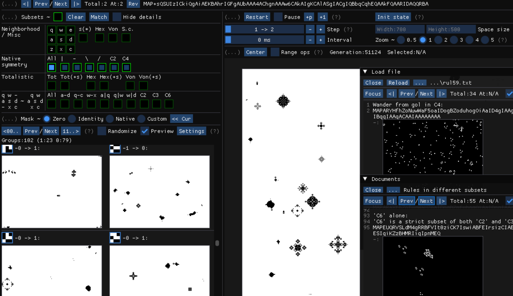
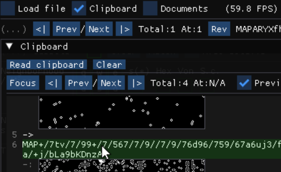

### Moody
(Renamed from *Astral* in version 0.9.5)

This program helps to explore a set of cellular automaton rules known as "[MAP rules](https://golly.sourceforge.io/Help/Algorithms/QuickLife.html#map)". In short, MAP rules are 2-state rules in the range-1 Moore neighborhood. They are a strict superset of outer-totalistic rules, the most famous one being [Conway's Game of Life](https://conwaylife.com/wiki/Conway%27s_Game_of_Life).

#### Features
- Rules are saved as MAP-strings, so they can be accepted by other programs like Golly. Also, patterns can be saved as RLE-strings.
- Subset-based rule operations:
    - The program supports many subsets, and can identify which subsets a MAP rule belongs to. Also, you can select multiple subsets to explore rules in their intersection (for example, to explore self-complementary isotropic rules).
    - The program has access to all rules in any subset. It's very easy to find new rules either by getting random rules in the `Randomize` window, or by modifying existing ones. With the help of preview mode (`Preview`), it's easy to see where to edit for other interesting rules that are close to the current rule.
- (WIP) The program is able to extract value constraints from patterns, and generate rules under the constraints (for example, rules allowing for gliders).

There are a lot of rules available in the [rules/](rules) folder discovered by this program. You can load these rules from files or the clipboard to have a look.

#### Getting started
The binary built for Windows 10 is available at the [latest-release](../../releases/latest) page. For usage in other environments, see the [Building](#building) section below. It's recommended to place the program in a separate folder, as it will create an "imgui.ini" file in the same directory.

In the program: press 'H' to learn about basic operations; check every tooltip; check the `Documents` in the program to get familiar with the concepts and workflow. Here are some basic operations:
- Saving/undoing rules: right-click the MAP-string (for the current rule) to save to the clipboard; use `<| Prev/Next |>` on its left for undoing/redoing.
- Saving patterns: right-click to select area and press 'C' to save the pattern to the clipboard (as RLE-string).
- Pasting rules: open the `Clipboard` window and click `Read clipboard` to load rules from the clipboard.

#### Building
The project is written in C++20 using [ImGui](https://github.com/ocornut/imgui) and [SDL2](https://github.com/libsdl-org/SDL) libraries, and uses CMake for building. ImGui is included in this project, and SDL2 will be fetched automatically by CMake.

In my experience, on Windows it should be easy to open and build the project with Visual Studio (CMake tools required). There is no explicit dependency on OS-specific features, so hopefully the project will also work on other systems.
